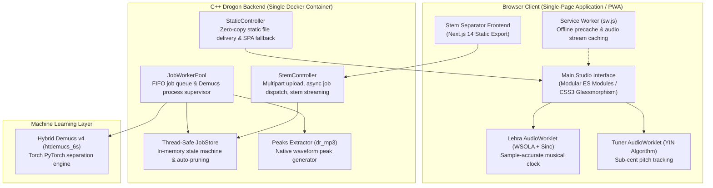
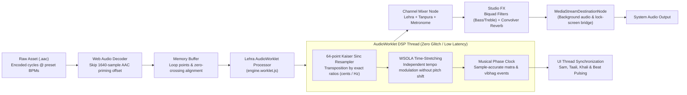
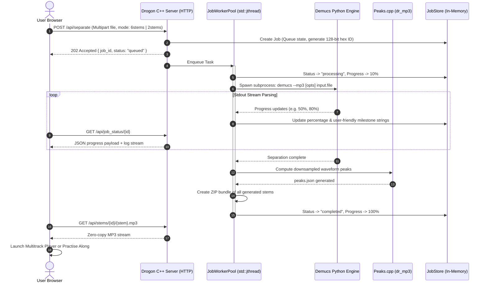

# 🎵 Swaralaya — Indian Classical Practice Studio & AI Suite

<div align="center">


<p align="center">
  <b>A state-of-the-art practice studio and accompaniment laboratory for Indian classical musicians.</b><br/>
  Runs real-time DSP in the browser paired with an asynchronous C++ (Drogon) microservice and Deep Learning audio source separation.
</p>

[Quick Start](#-quick-start) • [Architecture](#-system-architecture--technical-deep-dive) • [Core Features](#-core-features) • [Developer Guide](#-developer-guide--local-setup) • [Reference](#-musical-reference)

</div>

> [!IMPORTANT]
> **Educational & Research Notice:** This software was designed to explore real-time Web Audio DSP (WSOLA, Kaiser-windowed sinc interpolation, YIN pitch detection) and containerized AI stem separation workflows. Copyrighted demonstration recordings are included under fair use solely for educational study.

---

## 🧭 System Overview

| Component | Route | Technology | Purpose |
|---|---|---|---|
| **Lehra Player** | `/lehra` | Web Audio API + AudioWorklet | Real-time lehra playback, dynamic Kaiser-sinc pitch shifting, WSOLA time stretching, theka, taal circle, laya trainer, tanpura, MP3/WAV export, shareable setup links |
| **Notation Editor** | `/notation` | Web Audio Synthesizer + Canvas | Bhatkhande/Paluskar notation creator with synthesized tabla & vocal playback, PDF export & stateless URL compression |
| **Carnatic Suite** | `/carnatic` | Lookahead Scheduler + Audio Nodes | Plucked tanpura & reed shruti box drone + 35 suladi talas with visual kriya indicators and sound triggers |
| **Swar Tuner** | *Global Header* | AudioWorklet + YIN Pitch Algorithm | Real-time swar detection relative to base Sa in Just Intonation or Equal Temperament (cents deviation needle) |
| **AI Stem Separator** | `/separator/` | Next.js 14 + Drogon C++ + Demucs | Extracts vocals, drums, bass, guitar, piano & other using Meta's `htdemucs_6s` neural network |
| **Practise Along** | `/practice` | AudioWorklet (Song Mode) | Transpose, time-stretch and isolate stems from separated songs to practise along in real time; the song's Sa is detected from its vocals; A–B loop for repeating a phrase |
| **Riyaz Games** | `/games` | Web Audio + Lehra engine clock | *Swar Pehchaan* (ear training: name the swar sung over a drone, 5 levels) and *Sam Pakdo* (rhythm: tap on sam while the real lehra plays, judged to the millisecond against the audio actually heard; 6 unlockable stages) |

---

## 🏗️ System Architecture & Technical Deep-Dive

Swaralaya is partitioned into a **client-side high-performance DSP engine** and an **ultra-low-overhead C++ backend**:

### 1. High-Level Architecture



---

### 2. Client-Side Real-Time DSP Audio Pipeline

The Lehra player does **not** rely on server-rendered audio or standard HTML5 `<audio>` element playback. Instead, it uses custom Web Audio DSP pipelines running on dedicated AudioWorklet threads:



#### Key DSP Innovations:
- **Kaiser Sinc Pitch Shifting**: Transposes master recordings to any fundamental frequency ($87.31\text{ Hz}$ to $207.65\text{ Hz}$) with minimal alias distortion.
- **Waveform Similarity Overlap-Add (WSOLA)**: Real-time time-stretching with dynamic correlation search keeps transients crisp when adjusting tempo between $30$ and $500\text{ BPM}$.
- **AAC Priming Offset Truncation**: Strips encoder silence (1640 samples) so cycle loop boundaries remain sample-accurate.
- **Lock-Screen Background Playback**: Bypasses mobile browser suspension by piping the `AudioContext` destination through a `MediaStreamAudioDestinationNode` into a virtual audio element.

---

### 3. Asynchronous C++ Backend & AI Pipeline

The backend server is written in **C++20** using the event-driven **Drogon framework**, guaranteeing sub-millisecond static file delivery and non-blocking job queuing:



---

## ⚡ Quick Start

> [!TIP]
> **On Windows, just double-click [`start_website.bat`](start_website.bat).** It uses Docker Desktop when it's running (the full site), otherwise the local server below, and opens your browser as soon as the site is up. If the site is already running it simply opens the browser.

### 1. Full site with Docker (recommended)
Everything, including the AI Stem Separator. Needs [Docker Desktop](https://www.docker.com/products/docker-desktop/) running.
```bash
git clone https://github.com/MadhurSikarwar/Swarlaya-Music.git
cd Swarlaya-Music
docker compose up --build
```
Open **`http://localhost:3000`**. The first build compiles the C++ server and takes a while; later starts are quick. Stop it with Ctrl+C (or `docker compose down`).

### 2. Without Docker (local server)
The Lehra player, Tuner, Notation Editor and Carnatic suite — everything except the Stem Separator — with just Python 3.8+:
```bash
cd Swarlaya-Music
python tools/dev_server.py
```
Open **`http://localhost:3000`** (pass another port if 3000 is taken: `python tools/dev_server.py 3001`). It serves the site exactly like the real server — `/lehra`, `/notation`, `/practice` links work, and edited files reload fresh — and answers the separator's API with a message pointing to Docker.

### 3. Host it for free on Vercel
The website is static files, so it runs on Vercel's free Hobby plan (no sleeping, HTTPS, global CDN). Everything works there except the Stem Separator and Practise Along, which need the AI server — on Vercel those pages say so instead of failing.

1. Sign in at [vercel.com](https://vercel.com) with GitHub → **Add New… → Project** → import this repository.
2. Leave every setting as it is — [`vercel.json`](vercel.json) already sets the build (`node tools/build-static.mjs`, output `dist`), the page links (`/lehra`, `/notation`, …) and caching.
3. **Deploy.** Every push to `main` redeploys automatically.

To check the build locally first: `node tools/build-static.mjs` (writes `dist/`), then `python tools/dev_server.py 3001 dist` serves it the way Vercel will. If you later run the separator server somewhere (e.g. Azure Container Apps), add a rewrite in `vercel.json` sending `/api/(.*)` to `https://<your-server>/api/$1` and both pages start working.

#### Search engines (SEO)
The site is a single-page app, so on its own every route would answer with the home page's title and description. The static build fixes that for search engines and link previews:

* **A page per route.** `tools/build-static.mjs` writes `/lehra`, `/notation`, `/carnatic`, `/games`, … as their own HTML files, each with its own `<title>`, meta description, canonical URL, Open Graph / Twitter tags and schema.org structured data, one `<h1>`, and that page's view already showing (no flash of the home page, and readable without JavaScript). The text for each page lives in one table, [`public/js/core/routes.js`](public/js/core/routes.js), which the browser uses too when you move between pages.
* **`robots.txt` and `sitemap.xml`** are generated. The sitemap lists the indexable pages; `/practice` (it only makes sense with your own `?job=…`) is marked `noindex`, and so is the Stem Separator page until an `/api/` rewrite puts its server behind the site — then it is listed automatically.
* **The site's address** for canonical URLs and the sitemap comes from Vercel itself (`VERCEL_PROJECT_PRODUCTION_URL`), so there is nothing to configure. If you add a custom domain and want that one to be canonical, set an environment variable **`SITE_URL`** (e.g. `https://swaralaya.in`) in the Vercel project and redeploy. A local build without either simply leaves the canonical URLs and the sitemap out.
* Scripts are hinted with `modulepreload`, so the browser fetches the whole module graph at once.

After the first deploy, add the site to [Google Search Console](https://search.google.com/search-console) and submit `https://<your-domain>/sitemap.xml`.

---

## 🎛️ Core Features

### 🎻 1. The Lehra Player
* **Authentic Instruments:** Master studio recordings of Sarangi, Esraj, Harmonium, and Sitar.
* **Flexible Sa & Pitch:** Select standard keys (F# low to G high) or calibrate down to fractional Hertz ($87.31\text{ Hz}$ to $207.65\text{ Hz}$).
* **Seamless Tempo Modulations:** Change BPM via presets, slider, or **TAP** tempo. Crossfades seamlessly on the fly.
* **Dynamic Tanpura:** Choose between classic acoustic loops or custom synthesized plucked models (Male C# / Female G#) with custom Pa, Ma, or Ni lead strings.
* **Laya Trainer:** Programmatic tempo ramping across designated cycle increments.
* **Raag Finder, Favourites & Recents:** One search box across the whole catalogue — type a raag, taal or instrument in any common spelling ("bageshri jhap", "tintal sitar") and pick with the keyboard. Star a raag to keep it as a chip above the lists; the ones you play are remembered too.
* **Mini Player:** When the transport has scrolled out of view (on a phone it sits several screens down), a small bar at the bottom keeps play / stop, the raag and the current matra within reach.
* **Keyboard Shortcuts:** Space, S, ↑ ↓ (Shift for ± 5 BPM), T, L, M, F, `/` to search and `?` for the list.
* **Riyaz Tracker & Streaks:** Tracks active playing time per local day with streak goals stored privately in `localStorage` — with totals for the week and all time, and a "continue your riyaz" card on the home page that reopens your last setup.
* **Studio FX:** Integrated dual-band shelving EQ (Bass & Treble) and dynamic convolution reverb.
* **Taal Circle:** One avartan drawn as a chakra beside the Now Playing card — sam at the top, matras clockwise, vibhag dividers with their X / 2 / 0 / 3 markers, and the theka's bols inside the ring. A hand sweeps round it on the engine's own musical clock, so it stays locked to the audio through tempo changes.
* **Share a Setup:** "Copy share link" in Presets makes a `/lehra#s=…` link that opens the exact instrument, taal, raag, tempo, Sa, volumes and options on any device — nothing is uploaded.
* **Intonation Report:** Each Record riyaz take can be analysed (YIN, offline, on a microphone-only copy): a pitch graph over the swar lines, the share of held notes within ±20 cents, and which swaras drift sharp or flat. Glides aren't judged.
* **Audio Export (MP3 / WAV):** Save the current raag, taal, instrument, tempo and Sa as a file of any length (minutes or whole cycles, ending on sam) — optionally with the tanpura and metronome. Rendered on the device with the playback engine's own DSP in a Web Worker (~70× real time), mixed through the same FX chain in an `OfflineAudioContext`, and encoded as 16-bit WAV or 192 kbps MP3 (LAME, loaded on demand and integrity-checked).

---

### 🎙️ 2. Swar Tuner
* **High-Precision YIN Algorithm:** Evaluates pitch in an `AudioWorklet` with zero frame drops or lag.
* **Classical Intonation:** Compare live pitch against either pure **Just Intonation** (Gandhar/Nishad harmonic alignment) or **12-TET** equal temperament.
* **Microtonal Deviation:** Real-time needle displaying exact deviation in cents with octave registers (Mandra, Madhya, Taar).

---

### 🎼 3. Notation Editor
* **Classical Systems:** Full support for both **Bhatkhande** and **Paluskar** notations in English and Hindi script.
* **Interactive Synthesis:** Synthesized tabla strokes (bayan boom and dayan bell harmonics) and formant-filtered vocal sargam.
* **Stateless Link Sharing:** Encodes the complete score into the URL hash using Deflate compression — zero cloud storage required.
* **Export Options:** One-click vector PDF generation or PNG score snapshots.

---

### 🪘 4. Carnatic Suite
* **Shruti Box:** Plucked tanpura or reed shruti drone tuned across all 14 kattai positions ($1$ kattai C through $7$ kattai B).
* **Talam Engine:** Exact rhythmic kriyas (Clap, Wave, Finger counts) for Adi, Rupaka, Misra Chapu, Khanda Chapu, and all 35 Suladi Talas.
* **Nadai & Kalai:** 1-kalai and 2-kalai modes with customizable subdivisions ($2$, $3$, $4$, $5$, $7$).

---

### 🤖 5. AI Stem Separator & "Practise Along"
* **Demucs v4 Neural Net:** Isolates 6 stems (*Vocals, Drums, Bass, Guitar, Piano, Other*) or Fast 2-stem (*Vocals + Accompaniment*).
* **Practise Along Mode:** Load any song's accompaniment into the Lehra engine as a continuous loop.
* **Harmonic Match:** Transpose any audio file by semitones to match your personal Sa scale, and adjust speed from $50\%$ to $150\%$ without pitch drift.
* **Automated Ephemeral Lifecycle:** Jobs and uploaded files automatically expire and purge after 60 minutes.

---

## 🛠️ Developer Guide & Local Setup

### Repository File Structure
```
webapp/
├── .github/workflows/       # GitHub Actions CI workflow (lint, test, build, smoke)
├── drogon_server/           # High-Performance C++ Backend (Drogon Framework)
│   ├── controllers/         # StaticController, StemController, HealthController
│   ├── models/              # Thread-safe JobStore & lifecycle management
│   ├── services/            # JobWorkerPool subprocess supervisor
│   ├── utils/               # dr_mp3 header, Peaks waveform extractor, Security
│   └── CMakeLists.txt       # C++20 build definitions & compiler optimizations
├── public/                  # Static web client assets
│   ├── css/                 # Glassmorphic responsive design system
│   ├── js/                  # ES Modules (Zero bundler requirement)
│   │   ├── core/            # AudioContext, master routing, mic, router & page metadata, toasts, app install
│   │   ├── lehra/           # Real-time WSOLA engine, worklet, player, tools
│   │   ├── carnatic/        # Shruti & Talam metronome lookahead engines
│   │   ├── notation/        # Score editor, synthesizer & Deflate share engine
│   │   ├── tuner/           # YIN AudioWorklet pitch tracker
│   │   ├── practice/        # Song mode accompaniment engine
│   │   └── main.js          # App lifecycle initialization
│   └── separator/           # Pre-compiled static export of stem-frontend
├── stem-frontend/           # Standalone Next.js 14 multitrack separator UI
├── assets/                  # High-quality audio cycles, tanpura plucks, metronome
├── tests/                   # Automated node:test unit suites & smoke shell tests
├── tools/                   # dev_server.py, build-static.mjs (Vercel build) and seo.mjs (per-route pages, sitemap)
├── Dockerfile               # Multi-stage production container build
└── docker-compose.yml       # Production/local runtime configuration
```

### Running Tests & Linting
```bash
# Install development dependencies
npm install

# Run static code analysis across JS modules and service worker
npm run lint

# Execute the 52 unit test suites (DSP math, intonation, scheduler, caching)
npm test

# Run HTTP integration and API validation smoke test (server must be running)
bash tests/smoke.sh http://localhost:3000
```

---

## 📖 Musical Reference

<details>
<summary><b>🎼 All 27 Instrument & Taal Combinations</b></summary>
<br/>

| Instrument | Taal | Beats | Tempo Range (BPM) | Available Raags |
|:---|:---|:---:|:---:|:---|
| **Sarangi** | Roopak | 7 | 60–240 | Charukeshi |
| **Sarangi** | Jhaptaal | 10 | 30–180 | Bageshree, Bahar |
| **Sarangi** | Jai Taal | 13 | 45–180 | Jog |
| **Sarangi** | Pancham Sawari | 15 | 60–180 | Charukeshi |
| **Sarangi** | Teentaal | 16 | 30–500 | Bhairavi, Bhupali, Desh, Jog, Madhukauns, Mand, Nat Bhairav, Kalawati, Gorak Kalyan, Chandrakauns, Binna Shadja |
| **Esraj** | Roopak Taal | 7 | 65–240 | Kedar |
| **Esraj** | Matta Taal | 9 | 50–150 | Darbari Kanada |
| **Esraj** | Jai Taal | 13 | 50–180 | Alhayia Bilwal |
| **Esraj** | Roopak Double Cycle | 14 (2 × 7) | 65–240 | Kedar |
| **Esraj** | Teentaal | 16 | 30–500 | Chandrakauns, Bageshree, Sohini, Kirwani, Misra Tilang, Jaijaiwanti, Charukeshi, Madhuwanti, Saraswati |
| **Harmonium** | Roopak Taal | 7 | 55–240 | Patdeep |
| **Harmonium** | Jhaptaal | 10 | 30–180 | Jaijawanti, Tilang |
| **Harmonium** | Sool Taal | 10 | 55–180 | Kedar |
| **Harmonium** | Ektaal | 12 | 50–240 | Gavti |
| **Harmonium** | Dhamar | 14 | 55–180 | Charukeshi |
| **Harmonium** | Pancham Sawari | 15 | 45–180 | Chandrakauns |
| **Harmonium** | Teentaal | 16 | 30–500 | Kirwani, Misra Bhairavi, Bilaskhani Todi, Misra Kirwani, Misra Madhuwanti, Todi |
| **Sitar** | Roopak Taal | 7 | 60–240 | Bageshree |
| **Sitar** | Jhaptaal | 10 | 30–150 | Tilak Kamod, Shivranjani |
| **Sitar** | Rudra Taal | 11 | 50–180 | Kedar |
| **Sitar** | Ektaal | 12 | 50–240 | Kedar |
| **Sitar** | Jai Taal | 13 | 45–180 | Hindol |
| **Sitar** | Neel Taal | 15 | 60–180 | Bageshree |
| **Sitar** | Pancham Sawari | 15 | 45–180 | Hansadhwani |
| **Sitar** | Teentaal | 16 | 30–500 | Bhimpalasi, Charukeshi, Basant |
| **Sitar** | Sunand Taal | 19 | 45–180 | Hansadhwani |
| **Sitar** | Sardha Roopak | 21 | 30–150 | Bhimpalashree |

</details>

<details>
<summary><b>🥁 Classical Thekas & Vibhag Structures</b></summary>
<br/>

| Taal | Beats | Structured Theka (`|` indicates vibhag boundary) |
|---|:---:|---|
| **Teentaal** | 16 | **X** Dha Dhin Dhin Dha \| **2** Dha Dhin Dhin Dha \| **0** Dha Tin Tin Ta \| **3** Ta Dhin Dhin Dha |
| **Jhaptaal** | 10 | **X** Dhi Na \| **2** Dhi Dhi Na \| **0** Ti Na \| **3** Dhi Dhi Na |
| **Ektaal** | 12 | **X** Dhin Dhin \| **0** DhaGe TiRaKiTa \| **2** Tu Na \| **0** Kat Ta \| **3** DhaGe TiRaKiTa \| **4** Dhi Na |
| **Roopak** | 7 | **0** Tin Tin Na \| **1** Dhi Na \| **2** Dhi Na |
| **Dhamar** | 14 | **X** Ka Dhi Ta Dhi Ta \| **2** Dha – \| **0** Ga Ti Ta \| **3** Ti Ta Ta – |
| **Sool Taal** | 10 | **X** Dha Dha \| **0** Din Ta \| **2** Kita Dha \| **3** Tita Kata \| **0** Gadi Gana |

</details>

<details>
<summary><b>🎶 Carnatic Kattai to Hertz Scale Mapping</b></summary>
<br/>

| Kattai | 1 | 1½ | 2 | 2½ | 3 | 4 | 4½ | 5 | 5½ | 6 | 6½ | 7 |
|:---:|:---:|:---:|:---:|:---:|:---:|:---:|:---:|:---:|:---:|:---:|:---:|:---:|
| **Western Note** | C | C# | D | D# | E | F | F# | G | G# | A | A# | B |
| **Fundamental (Hz)** | 130.81 | 138.59 | 146.83 | 155.56 | 164.81 | 174.61 | 185.00 | 196.00 | 207.65 | 220.00 | 233.08 | 246.94 |

</details>

---

## 🔒 Privacy & Offline Capability
- **Zero Analytics & Tracking:** No third-party analytics, user tracking, or fingerprinting scripts.
- **Microphone Isolation:** Audio captured during tuning or riyaz recording is evaluated purely in-memory in private `AudioWorklet` buffers; audio is never dispatched to any remote server.
- **Full Offline PWA:** The lehra player, tuner, notation editor, and Carnatic tools cache automatically via `sw.js` and operate seamlessly without an internet connection.

---

<div align="center">
  <b>Built with devotion to Indian Classical Music & modern web DSP engineering.</b>
</div>
